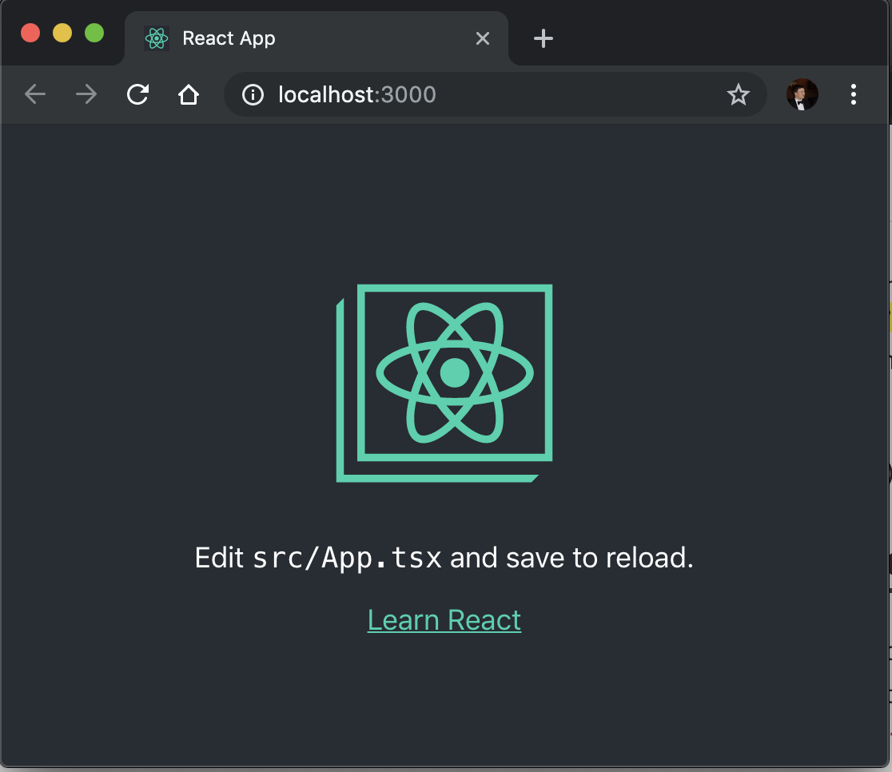

# TypeScript For React Developers

> N.B. I will continue updating this repository until Tuesday evening, so please make sure you run `git pull` and `yarn` on Wednesday, if you follow these instructions before then.

Before the workshop, please make sure you:

1. Download and install the latest LTS release of node from https://nodejs.org/en/
2. Install the latest stable version of yarn from https://yarnpkg.com/lang/en/docs/install/
3. Install VSCode from https://code.visualstudio.com (you can use another editor if you prefer)
4. I also recommend installing the [React Developer Tools](https://chrome.google.com/webstore/detail/react-developer-tools/fmkadmapgofadopljbjfkapdkoienihi?hl=en).
5. Clone this repository: `git clone https://github.com/ForbesLindesay/typescript-for-react-developers.git`
6. Open a new terminal in this repository and run `yarn`
7. Run `yarn prepared`

If you've done everything right, when you run step 7, you should see something approximately like:

I recommend you don't look through the exercises or answers in advance, and come to the workshop ready to learn. I look forward to seeing you at the workshop in Alicante.
